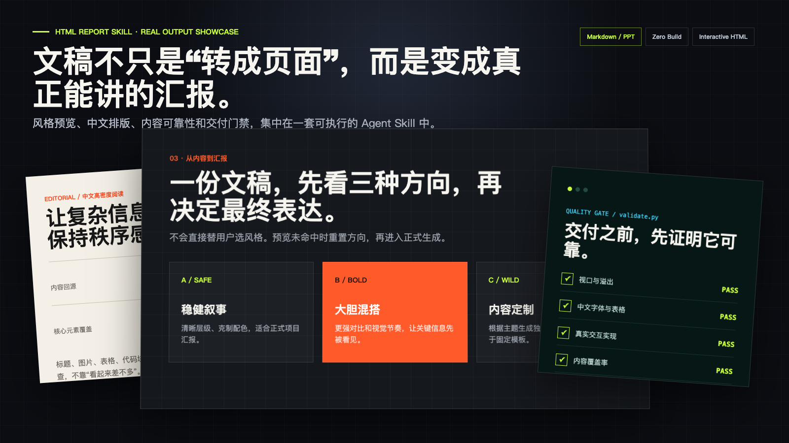

[简体中文](README.md) | [English](README_EN.md)

# HTML Report Skill

> 把 Markdown 或 PowerPoint 变成可以直接投屏、分享和继续编辑的中文 HTML 汇报。




很多文档转演示的工具只解决“能生成页面”。真实工作汇报还需要更多东西：中文排版不能散，表格不能乱，图片要能放大看，内容不能丢，生成后要有质量门禁，最后还得能让用户确认后再导出或分享。

HTML Report Skill 做的就是这件事：在优秀开源项目 [zarazhangrui/frontend-slides](https://github.com/zarazhangrui/frontend-slides) 的基础上，把它打磨成更适合中文工作汇报、项目演示、技术分享和文档可视化的 Agent Skill。

当前版本：**1.0.0 MVP 公开试用版**。

## 为什么值得用

- **先看风格，再正式生成**：正式生成前会先给 3 套真实 HTML 预览，不喜欢可以重选，不会直接替你拍板。
- **更适合中文汇报**：中文字体回退、表格左对齐、章节标题、内容密度、稀疏页居中和高密度阅读都有明确规则。
- **内容可靠性更强**：生成前回读原文，交付时检查标题、图片、表格、代码块、列表是否覆盖。
- **不是只会静态排版**：支持弹窗、tooltip、图片 lightbox、证据轮播、浏览器内编辑等真实交互。
- **有质量门禁**：`validate.py` 会检查视口、布局、交互、打印、字体、响应式和交互声明是否兑现。
- **交付路径闭环**：先让你在本机浏览器确认 HTML，再进入分享、部署或 PDF 导出。

## 相比 frontend-slides 增强了什么

本项目不是上游官方版本。它保留了 frontend-slides 的 HTML slide 生成理念、Phase 流程、风格预设基础、PPT 转换基础和 Vercel / PDF 交付思路，同时重点补强了中文工作汇报里的高频问题。

| 问题 | 本项目增强 |
|---|---|
| 图片只能普通展示，架构图和截图不便细看 | 图片分类呈现，默认支持点击放大和引用说明 |
| 预设风格容易趋同 | 3 套预览采用安全预设、大胆混搭、创意方向的组合策略 |
| 中文表格阅读效率低 | 表格默认左对齐，表头强调，列数/行数过多时触发拆分或缩放规则 |
| 中文字体容易回退到不合适的系统字体 | 增加中文字体回退链、中文行高和禁用首行缩进规则 |
| 交互经常只写在说明里，没有真实实现 | 声明了弹窗、tooltip、轮播，就必须提供真实可操作实例 |
| MD 分析摘要传递过程中可能丢图片、表格或代码块 | Phase 3 生成前回源读取原文，交付时输出内容覆盖率判断 |
| 生成完缺少客观质量检查 | `validate.py` 做静态质量门禁，80 分以下阻塞交付 |
| 用户还没确认效果就进入导出/部署 | Phase 5 先打开 demo 让用户确认，再进入 Phase 6 |

## 它是怎么组织起来的

这个项目不是把所有提示词、风格和规则堆进一个超长文件，而是采用 **Harness Engineering + 渐进式披露** 的组织方式：

- `SKILL.md` 负责主工作流、阶段门禁和平台能力适配，相当于生成流程的执行骨架。
- `references/style-presets/index.json` 只保存风格索引，确认候选方向后才读取对应的独立预设文件。
- 排版、交互、动画、视口和 HTML 模板分别维护，按当前任务需要加载，而不是一次性注入全部上下文。
- `content_coverage.py` 和 `validate.py` 负责可执行验证，让内容完整性和质量判断不只依赖模型自觉。

这种结构的目标是让 agent 在有限上下文里拿到“当前阶段真正需要的信息”，同时用脚本和门禁约束关键结果。

## 30 秒快速开始

推荐使用通用 Agent Skills installer：

```bash
npx skills@latest add chengzi2333/html-report-skill -g
```

如果你只想先确认 installer 能否发现这个 skill：

```bash
npx skills@latest add chengzi2333/html-report-skill --list
```

安装后新开一个 agent 会话，直接说：

```text
请使用 HTML Report Skill，把这份 Markdown 转成中文汇报 HTML。
```

页数、用途、内容密度、浏览方式和风格会在流程中继续确认，不需要一开始就全部写死。

## 安装方式

### 方式 A：npx 安装，推荐

```bash
npx skills@latest add chengzi2333/html-report-skill -g
```

指定安装到某个平台：

```bash
npx skills@latest add chengzi2333/html-report-skill -g -a codex
npx skills@latest add chengzi2333/html-report-skill -g -a antigravity
npx skills@latest add chengzi2333/html-report-skill -g -a claude-code
npx skills@latest add chengzi2333/html-report-skill -g -a cursor
```

安装到当前项目：

```bash
npx skills@latest add chengzi2333/html-report-skill
```

说明：`npx skills` 是 `vercel-labs/skills` 提供的通用 installer，不是本项目自己的 npm 包。它会检测 agent runtime，并把包含 `SKILL.md` 的完整 skill 目录安装到对应位置。

### 方式 B：手动 clone

如果你不想使用 npx，或者希望自己管理安装路径，可以直接 clone 到对应平台的 skills 目录。

Codex：

```bash
mkdir -p ~/.codex/skills
git clone https://github.com/chengzi2333/html-report-skill.git \
  ~/.codex/skills/html-report-skill
```

Antigravity：

```bash
mkdir -p .agents/skills
git clone https://github.com/chengzi2333/html-report-skill.git \
  .agents/skills/html-report-skill
```

Claude Code：

```bash
mkdir -p ~/.claude/skills
git clone https://github.com/chengzi2333/html-report-skill.git \
  ~/.claude/skills/html-report-skill
```

Cursor：

```bash
mkdir -p ~/.cursor/skills
git clone https://github.com/chengzi2333/html-report-skill.git \
  ~/.cursor/skills/html-report-skill
```

无论哪种方式，最终结构都应该是：

```text
<skills-directory>/html-report-skill/SKILL.md
```

不要只复制 `SKILL.md`。这个 skill 还需要 `references/` 和 `scripts/`。

## 平台状态

“官方 Skills 支持”表示平台能够发现 `SKILL.md`；“本项目验证状态”表示本项目是否已经完成安装、触发、生成、验证和交付的完整流程。

| 平台 | 官方 Skills 支持 | 本项目验证状态 | 说明 |
|---|---|---|---|
| Codex CLI / App | 支持 | 已完成端到端验证 | 当前主要验证平台之一 |
| Antigravity | 支持 | 已完成端到端验证 | 当前主要验证平台之一 |
| Claude Code | 支持 | 待完成端到端回归 | 可安装，但还需要本项目完整回归 |
| Cursor | 支持 | 待完成端到端回归 | 可安装，但还需要本项目完整回归 |

平台更新可能影响 skill 发现、上下文注入或原生提问能力。反馈问题时，请带上平台名称和版本。

## 使用方式

你可以给它 Markdown、README、方案文档或 PPT，然后让它生成汇报 HTML：

```text
请使用 HTML Report Skill，把 README.md 转成项目演示汇报 HTML。
```

常见流程：

1. 检测输入类型和运行环境。
2. 确认用途、篇幅、内容密度和浏览方式。
3. 生成并打开 3 套风格预览。
4. 用户选择风格、混合元素，或要求重新生成。
5. 生成正式 HTML。
6. 执行内容覆盖率和静态质量验证。
7. 用户确认后选择分享、部署或 PDF 导出。

## 安装验证

在安装后的 skill 目录里运行：

```bash
test -f SKILL.md
test -f references/style-presets/index.json
test -f scripts/validate.py
test -f scripts/content_coverage.py
```

`scripts/` 只包含 skill 运行时脚本。项目回归测试属于开发资产，不进入正式安装包。

## 更新与卸载

如果你用 `git clone` 安装：

```bash
cd <skills-directory>/html-report-skill
git pull
```

如果你用 `npx skills` 安装，可以重新执行安装命令，按 installer 提示更新。

卸载时删除对应 skills 目录中的 `html-report-skill` 文件夹即可。

## 已知限制

- 自动内容覆盖率当前主要服务 Markdown 主路径；PPT 仍需结合提取摘要和人工复核。
- `validate.py` 以静态规则检查为主，不能替代完整多视口视觉验收。
- PDF 导出需要 Playwright；Vercel 部署需要对应 CLI 和账号环境。
- Claude Code 和 Cursor 已支持 Agent Skills 格式，但本项目尚未完成这两个平台的完整回归。
- 当前主要针对中文汇报排版优化，英文长文档效果仍需更多反馈。

## Roadmap

后续迭代计划已经进入需求池，重点方向包括：

- 更完整的视觉验收与多视口检查。
- 更可执行、更丰富的风格预设。
- PDF 导出稳定性和更多分享/部署渠道。
- PPT 内容覆盖率增强及更多输入源研究。
- Claude Code、Cursor 等平台的完整端到端回归。

这个项目会根据真实使用反馈快速迭代。如果你在实际汇报中遇到排版、内容丢失、风格选择、交互或导出问题，请务必提交 Issue。具体、可复现的反馈会直接影响后续优先级。

## 反馈

请通过 [GitHub Issues](https://github.com/chengzi2333/html-report-skill/issues) 提交问题或建议。即使只是“这套风格不适合我的场景”或“这里的提问流程不顺”，也欢迎提出。

为了便于复现，请尽量提供：

- 使用平台和版本。
- 输入类型：Markdown 或 PPT。
- 可脱敏的输入片段。
- 生成的 HTML、截图或问题页面。
- 完整复现步骤。
- `validate.py` 和内容覆盖率输出。

安全漏洞不要提交公开 Issue，请阅读 [SECURITY.md](SECURITY.md)。

## License 与致谢

本项目基于 [zarazhangrui/frontend-slides](https://github.com/zarazhangrui/frontend-slides) 改造，保留原作者 Zara Zhang 的 MIT License 和版权声明：

```text
Copyright (c) 2025 Zara Zhang
```

本项目不是上游官方版本。详见 [LICENSE](LICENSE)。
